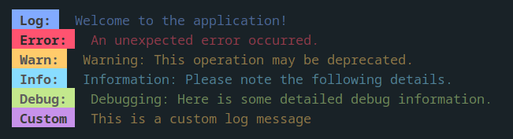

# console-log-colorizer

"console-log-colorizer" is a lightweight npm package that provides color-coded logging functionality in the console. It allows you to print log messages with different background and foreground colors, enhancing the visual representation of your logs.


## Installation

You can install the package via npm:

```shell
npm install console-log-colorizer
```

## Usage

The "console-log-colorizer" package can be used in various ways depending on your preference and project setup. Here are different import statements you can use to import the package:

### Importing the Default Export

```typescript
import logger from "console-log-colorizer";

logger.log("This is a log message");
logger.error("This is an error message");
```

In this usage, the default export of the package is imported as logger. You can directly call the logging functions on the logger object.

### Importing Specific Functions

```typescript
import { logger } from "console-log-colorizer";

logger.log("This is a log message");
logger.error("This is an error message");
```

In this usage, specific functions are imported from the package using destructuring. You can directly call the logging functions without the need for an object reference.

### Importing the global Function

```typescript
import { global } from "console-log-colorizer";

global();

console.log("This is a log message");
console.error("This is an error message");
```

The global function allows you to override the default console.log, console.error, console.warn, console.info, and console.debug functions with the corresponding logging functions from the "console-log-colorizer" package. Once global() is called, all subsequent calls to the standard console methods will be redirected to the color-coded logging functions.

### Importing with require (CommonJS)

```javascript
const logger = require("console-log-colorizer").default;

logger.log("This is a log message");
logger.error("This is an error message");
```

In this usage, the default export is imported using require in a CommonJS environment. The logging functions can be called on the logger object.

```javascript
const { logger } = require("console-log-colorizer");

logger.log("This is a log message");
logger.error("This is an error message");
```

Alternatively, specific functions can be imported using destructuring with require. The logging functions can be called directly without the need for an object reference.

### Importing the global Function with require (CommonJS)

```javascript
require("console-log-colorizer").global();

console.log("This is a log message");
console.error("This is an error message");
```

The global function can also be imported with require to override the standard console methods.

Choose the import style that suits your project and enjoy colorful and customizable logging!

### API

#### `logger`

The logger object provides the following methods for color-coded logging:

- `logger.log(...message: any[])`: void: Logs a message.
- `logger.error(...message: any[])`: void: Logs an error message.
- `logger.warn(...message: any[])`: void: Logs a warning message.
- `logger.info(...message: any[])`: void: Logs an informational message.
- `logger.debug(...message: any[])`: void: Logs a debug message.

#### `global`

The global function overrides the default console methods with colorized logging methods. After calling global(), the following console methods will be replaced:

- `console.log(...message: any[])`
- `console.error(...message: any[])`
- `console.warn(...message: any[])`
- `console.info(...message: any[])`
- `console.debug(...message: any[])`

## Customizing the Logger

The "console-log-colorizer" package provides a customizable logging function, `logger.logger`, which allows you to create your own color-coded log messages with specific background and foreground colors. This function gives you more flexibility in defining your logging styles.

### Function Signature

```typescript
logger.logger(
  title: string,
  message: any[],
  bgColor: COLORS = "Black",
  fgColor: COLORS = "White",
  level: LEVELS = "log"
): void
```

- title: The title or label for the log message.
- message: An array of message parameters to be logged.
- bgColor (optional): The background color for the log message. It should be one of the colors defined in the COLORS object exported from the package.
- fgColor (optional): The foreground color for the log message. It should be one of the colors defined in the COLORS object exported from the package.
- level (optional): The log level, which determines the console method used for logging. It should be one of the keys defined in the LEVELS object exported from the package.

### Example Usage

```javascript
logger.logger(
  "Custom",
  ["This is a custom log message with custom colors"],
  "Yellow",
  "Black",
  "log"
);
```

In the example above, the log message will have a yellow background color and black foreground color, and it will be logged using the console.log method.

Note: Make sure to use colors that are defined in the COLORS object exported from the package to ensure compatibility and consistent styling.

Feel free to experiment with different combinations of background and foreground colors to create log messages that suit your preferences and improve readability.

For more information about the available colors, refer to the "Colors" section in this README.

## Colors

The "console-log-colorizer" package provides a set of predefined colors that you can use for background and foreground styling. These colors can be accessed via the `COLORS` object exported from "console-log-colorizer". These colors can be passed to the `logger.logger` function as the `bgColor` and `fgColor` parameter.

### Available Colors

- Black
- Red
- Green
- Yellow
- Blue
- Magenta
- Cyan
- White

You can use these colors when customizing the logger or defining your own log messages.

```typescript
import { COLORS } from "console-log-colorizer";

const bgColor = COLORS.Red;
const fgColor = COLORS.White;
```

In the example above, COLORS.Red is used as the background color, and COLORS.White is used as the foreground color.
Feel free to experiment with different color combinations to enhance the visual representation of your log messages.

## Log Levels

The "console-log-colorizer" package supports different log levels that determine the console method used for logging. These log levels can be passed to the `logger.logger` function as the `level` parameter.

### Available Levels

- `log`: Logs general messages using `console.log`.
- `error`: Logs error messages using `console.error`.
- `warn`: Logs warning messages using `console.warn`.
- `info`: Logs informational messages using `console.info`.
- `debug`: Logs debug messages using `console.debug`.

```typescript
import { logger } from "console-log-colorizer";

logger.logger("Error", "This is an error message", "Red", "White", "error");
logger.logger("Warn", "This is a warning message", "Yellow", "Black", "warn");
logger.logger(
  "Info",
  "This is an informational message",
  "Cyan",
  "White",
  "info"
);
```

In the example above, different log levels are used to log messages with specific colors. The log level determines which console method is used for logging.

Feel free to choose the appropriate log level for your log messages based on their severity and intended purpose.

## License

This package is licensed under the MIT License. See the LICENSE file for details.
